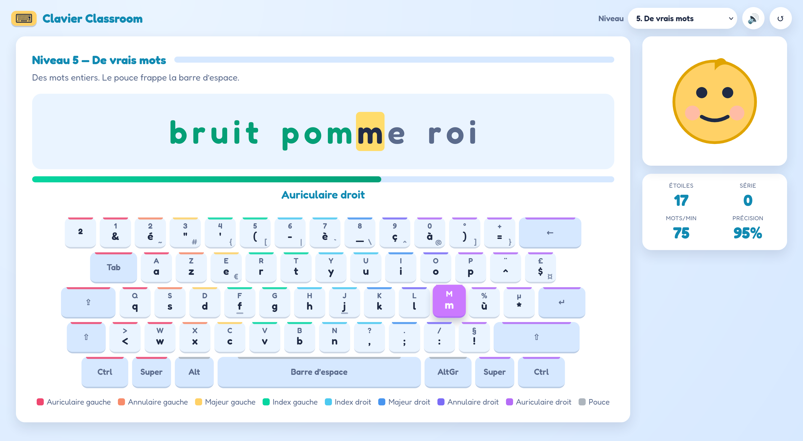

# Apprendre le clavier

Une application web pour apprendre à taper au clavier **AZERTY français**, pensée pour les enfants.
Elle affiche une séquence de caractères à reproduire : chaque touche juste passe en vert, chaque
erreur en rouge. Séquence terminée, une nouvelle apparaît.

100 % côté navigateur : HTML5, CSS et JavaScript, **sans aucune dépendance ni étape de build**.



## Démarrer

Le projet utilise des modules ES, que Chrome et Firefox refusent de charger depuis `file://`.
Il faut donc le servir par HTTP — n'importe quel serveur statique fait l'affaire :

```bash
git clone git@github.com:Issif/apprentissage-clavier.git
cd apprentissage-clavier
python3 -m http.server 8000
```

Puis ouvrir <http://localhost:8000>.

> **Disposition clavier** — l'application lit le caractère réellement produit par la frappe
> (`event.key`), donc elle suit la disposition configurée dans le système d'exploitation, pas celle
> de la page. Elle est conçue pour un **AZERTY français (fr-latin9 / fr-oss)**. Avec une autre
> disposition, le clavier affiché à l'écran ne correspondra plus aux touches réelles ; un
> avertissement s'affiche après 8 erreurs consécutives.

## Comment ça marche

**Le curseur n'avance pas sur une erreur.** Le caractère clignote en rouge, la mascotte réagit, mais
il faut trouver la bonne touche pour continuer. C'est plus formateur que d'accumuler les fautes et
de les corriger après coup.

**Le clavier à l'écran guide le doigté.** Chaque touche porte la couleur du doigt qui doit la
frapper, F et J ont leur repère tactile, et la touche attendue est mise en évidence. Quand le
caractère demande `Maj` ou `AltGr`, le modificateur s'allume lui aussi — la touche `Maj` indiquée
est toujours celle de la main opposée. Un libellé annonce le doigt en toutes lettres
(« Auriculaire droit », « Index gauche + AltGr (pouce droit) »).

**Les étoiles récompensent la propreté.** Une séquence sans la moindre faute vaut 3 étoiles, une
séquence rattrapée en vaut 1. La série compte les séquences parfaites d'affilée. Cinq séquences
réussies font passer au niveau suivant.

La progression (niveau, étoiles, record de vitesse, son) est enregistrée dans le `localStorage` du
navigateur. Le bouton ↺ remet tout à zéro. Si le stockage est indisponible — navigation privée,
site data bloqué — la partie reste jouable, seule la mémoire d'une session à l'autre est perdue.

## Les 12 niveaux

| # | Niveau | Ce qu'on y travaille | Exemple |
|---|---|---|---|
| 1 | La rangée de repos | `q s d f j k l m`, sans bouger les doigts | `dslf qfjf sqlk` |
| 2 | Les index s'étirent | ajout de `g` et `h` | `mkds gjkj kfkq` |
| 3 | La rangée du haut | `a z e r t y u i o p` | `dout ulty qeli` |
| 4 | La rangée du bas | `w x c v b n` — l'alphabet est complet | `nqdu iagn rtfu` |
| 5 | De vrais mots | mots français, et la barre d'espace au pouce | `jaune lac piano` |
| 6 | Les accents | `é è à ç`, sur la rangée des chiffres | `fée flèche glaçon` |
| 7 | La ponctuation | `. , ; : ! ?`, apostrophe et trait d'union | `c'est ! porte-clé ;` |
| 8 | Les chiffres | la rangée des chiffres, donc `Maj` en permanence | `660 5838 77` |
| 9 | Des phrases | majuscules, espaces, point final | `Nous mangeons une pomme rouge.` |
| 10 | Phrases et nombres | tout mélangé | `La récré dure 15 minutes, pas 30 !` |
| 11 | Les touches AltGr | `@ # { } [ ] \| \ €` | `@# ]€ {}` |
| 12 | Comme un pro | e-mails, prix, chemins, accolades | `5 € + 3 € = 8 €` |

Le vocabulaire est filtré sur les lettres déjà travaillées : aux niveaux 5 à 7, aucun mot ne
contient une touche que l'enfant n'a pas encore vue. Le sélecteur en haut à droite permet de sauter
directement à un niveau.

La typographie française est respectée : espace avant les signes doubles (`! ? ; :`), signes simples
(`. ,`) collés au mot.

## Structure du projet

```
index.html               structure de la page
css/theme.css            palette, polices, variables partagées
css/app.css              mise en page, clavier, animations
js/layout-azerty.js      description du clavier fr-latin9 : 3 niveaux par touche + doigt
js/sequences.js          les 12 niveaux, le vocabulaire et les générateurs de séquences
js/engine.js             position dans la séquence, validation, vitesse et précision
js/keyboard.js           rendu du clavier virtuel, surlignage, légende des doigts
js/progress.js           étoiles, série, persistance localStorage
js/audio.js              sons générés en WebAudio — aucun fichier à télécharger
js/main.js               boucle de jeu et branchement de l'interface
```

## Adapter le contenu

Tout se passe dans [`js/sequences.js`](js/sequences.js).

- **Ajouter des mots** : les listes `WORDS`, `WORDS_ACCENTS`, `PHRASES`, `NUMBER_PHRASES` et
  `SYMBOL_PHRASES` sont de simples tableaux de chaînes.
- **Ajouter un niveau** : une entrée dans `LEVELS` avec un `id`, un `name`, un `mode`
  (`letters`, `words`, `punct`, `digits`, `altgr`, `phrases`), un `hint` affiché à l'enfant, et pour
  les modes `letters`/`words` le jeu de caractères autorisé dans `chars`.
- **Changer le rythme** : la constante `SEQUENCES_PER_LEVEL` dans
  [`js/main.js`](js/main.js) fixe le nombre de séquences avant le niveau suivant.

Les couleurs, y compris celle de chaque doigt, sont des variables CSS regroupées en haut de
[`css/theme.css`](css/theme.css).

## Limites connues

- **Touches mortes** : `^` et `¨` produisent un événement `Dead` et demandent deux frappes. Elles
  sont affichées sur le clavier pour l'exactitude, mais aucun niveau ne les exige — donc pas de
  `â`, `ê`, `î` dans le vocabulaire.
- **Pavé numérique** : il n'est pas dessiné. Les chiffres tapés dessus sont acceptés, mais le
  clavier à l'écran continuera de montrer la rangée du haut.
- **AltGr** : signalé comme `AltGraph` sous Linux et macOS, comme `Ctrl+Alt` sous Windows. Les deux
  cas sont gérés.
- Le son est généré à la volée en WebAudio et ne démarre qu'après la première frappe, les
  navigateurs bloquant l'audio avant toute interaction.
