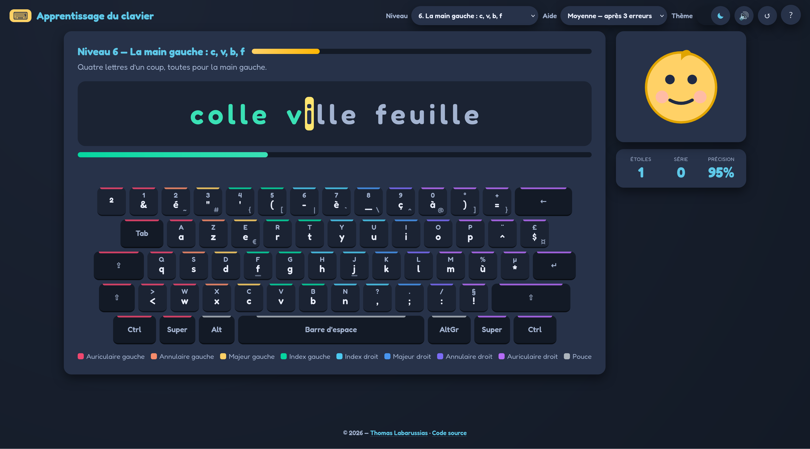

# Apprendre le clavier

Une application web pour apprendre à taper au clavier **AZERTY français**, pensée pour les enfants.
Elle affiche une séquence de caractères à reproduire : chaque touche juste passe en vert, chaque
erreur en rouge. Séquence terminée, une nouvelle apparaît.

100 % côté navigateur : HTML5, CSS et JavaScript, **sans aucune dépendance ni étape de build**.

**→ [apprentissage-clavier.fr](https://apprentissage-clavier.fr)**



## Démarrer

Le projet utilise des modules ES, que Chrome et Firefox refusent de charger depuis `file://`.
Il faut donc le servir par HTTP — n'importe quel serveur statique fait l'affaire :

```bash
git clone git@github.com:Issif/apprentissage-clavier.git
cd apprentissage-clavier
python3 -m http.server 8000
```

Puis ouvrir <http://localhost:8000>.

> **Disposition clavier** — l'application lit le caractère réellement produit par la frappe
> (`event.key`), donc elle suit la disposition configurée dans le système d'exploitation, pas celle
> de la page. Elle est conçue pour un **AZERTY français**, en variante PC (fr-latin9 / fr-oss) ou
> Apple. La plateforme est détectée automatiquement : sur macOS le clavier affiche ⌥ Option au lieu
> d'AltGr, et les combinaisons de troisième couche sont celles d'Apple. Avec une autre disposition,
> le clavier affiché ne correspondra plus aux touches réelles ; un avertissement s'affiche après
> 8 erreurs consécutives.

## Comment ça marche

**Le curseur n'avance pas sur une erreur.** Le caractère clignote en rouge, la mascotte réagit, mais
il faut trouver la bonne touche pour continuer. C'est plus formateur que d'accumuler les fautes et
de les corriger après coup.

**Le clavier à l'écran guide le doigté.** Chaque touche porte la couleur du doigt qui doit la
frapper, F et J ont leur repère tactile, et la touche attendue est mise en évidence. Quand le
caractère demande `Maj`, `AltGr` ou `⌥ Option`, le modificateur s'allume lui aussi — la touche
`Maj` indiquée est toujours celle de la main opposée. Un libellé annonce le doigt en toutes lettres
(« Auriculaire droit », « Index gauche + AltGr (pouce droit) »).

**L'aide est réglable.** Par défaut, rien n'est montré tant que la frappe est juste : c'est à
l'enfant de chercher la touche. Le sélecteur **Aide**, en haut à droite, décide à partir de combien
d'erreurs sur le caractère en cours la touche se dévoile sur le clavier.

| Réglage | La touche apparaît |
|---|---|
| Aucune aide | jamais |
| Élevée | après 1 erreur |
| Moyenne | après 3 erreurs |
| Faible | après 5 erreurs |

Le compteur repart à zéro dès qu'on passe au caractère suivant : l'indice ne reste pas affiché pour
le reste de la séquence. Le clavier dessiné reste visible en permanence et sert de plan de repère,
même en « aucune aide ».

**Les autres réglages.** Un sélecteur **Thème** bascule entre clair et sombre (par défaut il suit
le système). Le bouton **?** rouvre l'écran d'accueil, qui s'affiche tout seul à la première visite
et explique le principe en quelques lignes.

**Les étoiles récompensent la propreté.** Une séquence sans la moindre faute vaut 3 étoiles, une
séquence rattrapée en vaut 1. La série compte les séquences parfaites d'affilée. Cinq séquences
réussies font passer au niveau suivant.

La progression est enregistrée dans le `localStorage` du navigateur : niveau atteint, étoiles,
série, son, niveau d'aide, thème, et le fait d'avoir déjà vu l'écran d'accueil. Le bouton ↺ remet tout à zéro. Si le stockage est indisponible — navigation privée,
site data bloqué — la partie reste jouable, seule la mémoire d'une session à l'autre est perdue.

## Les 15 niveaux

| # | Niveau | Ce qu'on y travaille | Exemple |
|---|---|---|---|
| 1 | Quatre lettres pour commencer | nouvelles lettres : `e s i l` | `li si le se` |
| 2 | On ajoute a et n | nouvelles lettres : `a n` | `sa ainsi la` |
| 3 | On ajoute t et o | nouvelles lettres : `t o` | `ta toile tes` |
| 4 | Les deux index : r et u | nouvelles lettres : `r u` | `saute roi statue` |
| 5 | On ajoute d, m et p | nouvelles lettres : `d m p` | `moulin drapeau semaine` |
| 6 | La main gauche : c, v, b, f | nouvelles lettres : `c v b f` | `prince calendrier couteau` |
| 7 | Les lettres rares | nouvelles lettres : `g h j q z x y k w` | `chaton quille jouet` |
| 8 | Des phrases simples | premières phrases, sans accent ni majuscule | `mon chien joue dans la cour` |
| 9 | Les accents | `é è à ç`, sur la rangée des chiffres | `il répète sa leçon` |
| 10 | La ponctuation | signes de ponctuation et mots composés | `l'ami, saison !` |
| 11 | Les chiffres | la rangée des chiffres, donc Maj en permanence | `3438 36 5965` |
| 12 | Des phrases complètes | majuscules, espaces, point final | `Le train entre dans la gare.` |
| 13 | Phrases et nombres | lettres, chiffres et ponctuation mêlés | `Le livre a 250 pages.` |
| 14 | Les touches AltGr | `@ # { } [ ] \| \ €` | `@# ]€ {}` |
| 15 | Comme un pro | e-mails, prix, chemins, accolades | `D:\ecole\devoirs` |

**Les lettres n'arrivent pas rangée par rangée, mais par fréquence.** La ligne de repos AZERTY
(`q s d f g h j k l m`) ne contient aucune voyelle : tant qu'on s'y tient, il est *impossible* de
faire taper un vrai mot. Les sept premiers niveaux introduisent donc les lettres par petits groupes
choisis pour débloquer du vocabulaire tout de suite — dès le niveau 1, `e s i l` donnent *il, le,
les, elle, sel, lis*.

Chaque palier alterne deux choses : des syllabes formées avec les lettres déjà vues, pour installer
l'enchaînement des doigts, et de vrais mots, pour que l'exercice ait du sens. Les mots et syllabes
contenant une lettre nouvellement introduite sont privilégiés, sinon les derniers paliers
retomberaient sur le vocabulaire déjà acquis.

Le vocabulaire est filtré sur les lettres déjà travaillées : aucun mot ne contient une touche que
l'enfant n'a pas encore vue. Le sélecteur en haut à droite permet de sauter directement à un niveau.

La typographie française est respectée : espace avant les signes doubles (`! ? ; :`), signes simples
(`. ,`) collés au mot.

## Structure du projet

```
index.html               structure de la page
css/theme.css            palette, polices, variables partagées
css/app.css              mise en page, clavier, animations
js/layout-azerty.js      claviers AZERTY PC et Apple : 3 couches par touche, doigt, détection
js/sequences.js          les 15 niveaux, le vocabulaire et les générateurs de séquences
js/engine.js             position dans la séquence, validation, précision
js/keyboard.js           rendu du clavier virtuel, surlignage, légende des doigts
js/progress.js           étoiles, série, persistance localStorage
js/audio.js              sons générés en WebAudio — aucun fichier à télécharger
js/main.js               boucle de jeu et branchement de l'interface
```

## Adapter le contenu

Tout se passe dans [`js/sequences.js`](js/sequences.js).

- **Ajouter des mots** : les listes `WORDS`, `TOOL_WORDS`, `WORDS_ACCENTS`, `PHRASES`,
  `NUMBER_PHRASES` et `SYMBOL_PHRASES` sont de simples tableaux de chaînes. `TOOL_WORDS` contient
  les mots grammaticaux (*le, la, il, elle…*) sans lesquels les premiers paliers n'auraient rien à
  proposer.
- **Ajouter un niveau** : une entrée dans `LEVELS` avec un `id`, un `name`, un `mode`
  (`discover`, `letters`, `words`, `groups`, `punct`, `digits`, `altgr`, `phrases`), un `hint`
  affiché à l'enfant, et le jeu de caractères autorisé dans `chars`. Un palier `discover` porte en
  plus `fresh`, les lettres qu'il introduit.
- **Changer le rythme** : la constante `SEQUENCES_PER_LEVEL` dans
  [`js/main.js`](js/main.js) fixe le nombre de séquences avant le niveau suivant.
- **Régler les seuils d'aide** : le tableau `HELP_LEVELS` dans [`js/main.js`](js/main.js) associe
  chaque réglage à son nombre d'erreurs déclencheur.

Les couleurs, y compris celle de chaque doigt, sont des variables CSS regroupées en haut de
[`css/theme.css`](css/theme.css).

## Limites connues

- **Touches mortes** : `^` et `¨` produisent un événement `Dead` et demandent deux frappes. Elles
  sont affichées sur le clavier pour l'exactitude, mais aucun niveau ne les exige — donc pas de
  `â`, `ê`, `î` dans le vocabulaire.
- **Pavé numérique** : il n'est pas dessiné. Les chiffres tapés dessus sont acceptés, mais le
  clavier à l'écran continuera de montrer la rangée du haut.
- **AltGr** : signalé comme `AltGraph` ou `Ctrl+Alt` sous Windows et Linux, et comme la seule touche
  Option sous macOS. Seuls `Cmd` et `Ctrl` employé isolément sont laissés au navigateur.
- **Troisième couche Apple** : les correspondances macOS (`MAC_ALT_LAYER` dans
  [`js/layout-azerty.js`](js/layout-azerty.js)) sont plus fragiles que celles du PC et méritent
  d'être confirmées sur une vraie machine.
- Le son est généré à la volée en WebAudio et ne démarre qu'après la première frappe, les
  navigateurs bloquant l'audio avant toute interaction.

## Licence

[MIT](LICENSE) — © 2026 Thomas Labarussias.
